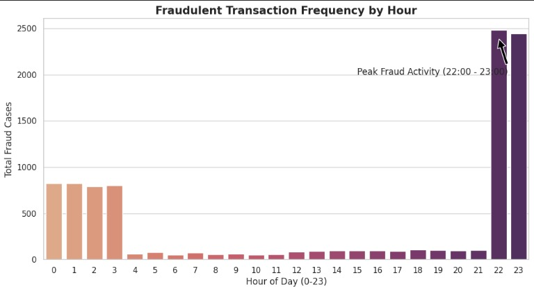
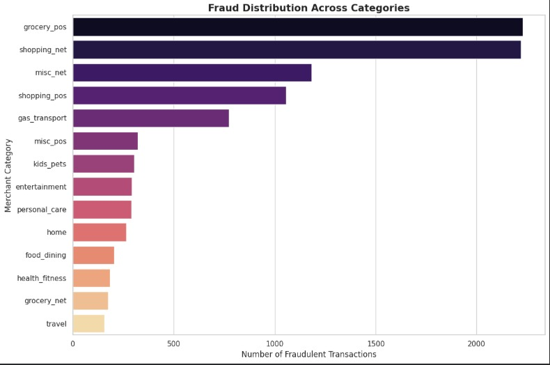
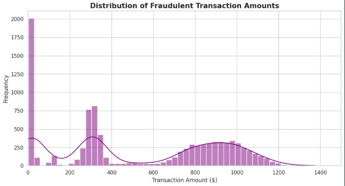
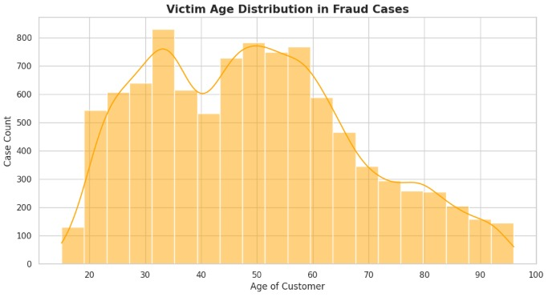

# 🛡️ Credit Card Fraud Detection: Behavioral & Statistical Analysis

## 📌 Project Overview
This project provides a comprehensive exploratory data analysis (EDA) of a credit card transaction dataset comprising over **1.8 million records**. By synthesizing temporal, categorical, and demographic data, this analysis identifies specific "critical windows" and high-risk profiles to inform better fraud prevention strategies.

## 🛠️ Tech Stack
* **Language**: Python 3.x
* **Key Libraries**: Pandas, NumPy, Matplotlib, Seaborn
* **Techniques**: Boolean Masking, Feature Engineering (Temporal Extraction, Haversine Distance), and Bimodal Statistical Analysis.

## 📂 Data Source
The dataset used in this analysis is the Credit Card Fraud Detection Dataset provided by Kartik Bhardwaj on Kaggle.

* **Source**: [Kaggle - Credit Card Fraud Detection Dataset](https://www.kaggle.com/datasets/kartik2112/fraud-detection)

* **Dataset Characteristics**: Contains simulated credit card transactions from Jan 1, 2019, to Dec 31, 2020, covering 1000 customers and 800 merchants.

## 📊 Key Insights & Findings

### 1. The "Critical Window" (Temporal Analysis)
* Fraudulent transactions exhibit a massive surge during late-night and early-morning hours, specifically between **22:00 and 03:00**.
* This "Critical Window" suggests perpetrators exploit periods of minimal real-time monitoring by cardholders.

### 2. Categorical Modus Operandi
* Overall, `grocery_pos` and `shopping_net` are the most frequent categories for fraud.
* **Shift in Behavior**: While **Online Shopping** (`shopping_net`) dominates the 10 PM window, **Physical Grocery** (`grocery_pos`) fraud unexpectedly peaks between **12 AM and 3 AM**, suggesting targeting of 24-hour retail locations.

### 3. Economic Impact (Amount Distribution)
* Fraudulent amounts follow a **bimodal distribution**, indicating two distinct theft strategies.
* **Testing Phase**: High frequency of low-value transactions ($0 - $28) used to verify card validity.
* **Maximization Phase**: Large-scale thefts typically range between **$800 and $1,100**, driving the average fraud amount to approximately **$651**.

### 4. Vulnerability Profile (Demographics)
* The primary victims identified are individuals in the **Senior/Baby Boomer demographic (Aged 50+)**.
* This group likely represents a high-value target due to higher credit limits and potential delays in digital security engagement.

## 📈 Visualizations
*(Note: Ensure your image files are stored in the `/images` folder of your repository)*

| Hourly Fraud Distribution | Categorical Fraud Frequency |
| :--- | :--- |
|  |  |

| Transaction Amount Distribution | Victim Age Profile |
| :--- | :--- |
|  |  |

## 🚀 Strategic Recommendations
* **Time-Based MFA**: Implement mandatory Multi-Factor Authentication for transactions above $500 initiated between 22:00 and 04:00.
* **Predictive Flagging**: Security algorithms should prioritize low-value "test" transactions as leading indicators of imminent high-value fraud.
* **Targeted Education**: Develop digital security awareness programs specifically tailored for the 50+ age demographic to mitigate high-risk vulnerability.

---
